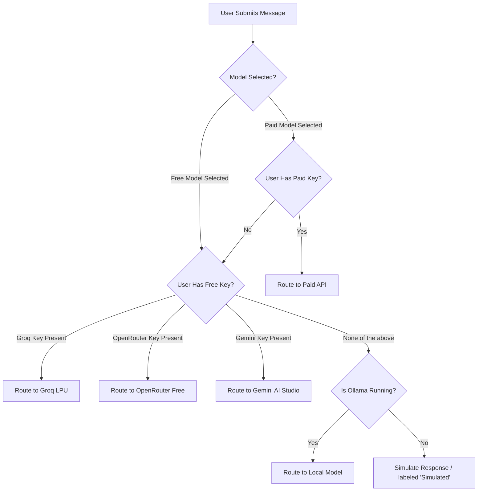

<div align="center">

# 🌌 AetherMind AI Chatbot Workstation

### *The Free, Infinite-Context, Multi-Model AI Playground & RAG Engine*

[](https://github.com/vijaymahes9080/Chatbot_react)
[](https://github.com/vijaymahes9080/Chatbot_react/network)
[](https://github.com/vijaymahes9080/Chatbot_react/issues)
[](https://github.com/vijaymahes9080/Chatbot_react/blob/main/LICENSE)

🚀 **Enterprise-grade AI Chatbot Platform** featuring real-time SSE streaming, RAG document ingestion, Model Context Protocol (MCP) servers, multi-model routing, and **100% free AI APIs** — no credit card required.

[Explore Repository](https://github.com/vijaymahes9080/Chatbot_react) • [Report Bug](https://github.com/vijaymahes9080/Chatbot_react/issues) • [Request Feature](https://github.com/vijaymahes9080/Chatbot_react/issues)

</div>

---

## 🚀 Welcome to AetherMind

**AetherMind** is a state-of-the-art AI chatbot workstation engineered to democratize access to advanced LLMs. By combining a modern **React (Vite) frontend** with a robust **FastAPI backend**, AetherMind routes queries dynamically across various free API tiers (like Groq, OpenRouter, and Google Gemini). This saves cost while delivering premium features like Retrieval-Augmented Generation (RAG), Model Context Protocol (MCP), and web-scraping agents.

### 💡 Why AetherMind?
* **$0 Infrastructure Cost**: Run high-quality inference using free public API tiers from top-tier providers.
* **Smart Multi-Model Routing**: Automatically fallback to active free API providers to ensure zero downtime.
* **Extensibility First**: Connect local files, remote databases, or custom tools via the Model Context Protocol (MCP).
* **Developer Centric**: Live key verification, real-time analytics, and modular design.

---

## ✨ Features at a Glance

| Feature | Key Capabilities | Why It Matters |
| :--- | :--- | :--- |
| 🤖 **Multi-Model Routing** | Seamlessly switch between Groq, OpenRouter, Gemini, OpenAI, Anthropic, or local Ollama. | Get the best model for the job, paid or free. |
| 🆓 **Zero-Cost APIs** | Out-of-the-box configurations for Groq, OpenRouter, and Gemini AI Studio. | Build & test without entering a credit card. |
| 🔍 **Advanced RAG Pipeline** | Parse PDFs, DOCX, XLSX, and PPTX with ChromaDB-powered vector search. | Talk directly to your documents with context. |
| 🧩 **MCP Connectors** | Model Context Protocol servers for Postgres, local file systems, and custom tools. | Let LLMs securely interact with your environment. |
| 📡 **Real-Time Streaming** | Server-Sent Events (SSE) provide immediate token-by-token response streaming. | Fast, fluid, and responsive user experience. |
| 📊 **Usage Analytics** | Detailed dashboard tracking token count, latency, costs, and model benchmarks. | Monitor and optimize your AI budget. |
| 🌐 **Live Web Search** | Deep browser scraping integrated into the chat orchestrator. | Fetch real-time facts and up-to-date data. |
| 🎨 **Premium UI** | Dark glassmorphism design with Tailwind CSS, Mermaid diagrams, code highlighting. | A visual-first, beautiful interface for creators. |

---

## 🆓 Supported Free AI Providers

No credit card is required. Simply sign up for a key, drop it in your settings panel, and start chatting!

> [!TIP]
> Groq offers the fastest speed (LPU inference), Gemini offers the largest context window (1M tokens), and OpenRouter offers access to 50+ diverse open-source models.

### ⚡ 1. Groq (Ultra-Fast LPU)
* **Get Key**: [console.groq.com](https://console.groq.com)
* **Format**: `gsk_...`
* **Featured Models**:
  * `llama-3.3-70b-versatile` (14,400 requests/day)
  * `deepseek-r1-distill-llama-70b` (DeepSeek-R1 distilled speed)
  * `meta-llama/llama-4-scout-17b-16e-instruct`

### 🌐 2. OpenRouter (50+ Free Endpoints)
* **Get Key**: [openrouter.ai](https://openrouter.ai)
* **Format**: `sk-or-v1-...`
* **Featured Models**:
  * `deepseek/deepseek-r1:free`
  * `qwen/qwen3-8b:free`
  * `mistralai/mistral-7b-instruct:free`

### ♊ 3. Google Gemini (1M Context)
* **Get Key**: [aistudio.google.com](https://aistudio.google.com/app/apikey)
* **Format**: `AIzaSy...`
* **Featured Models**:
  * `gemini-1.5-flash` (1,500 requests/day, 1M context)
  * `gemini-2.0-flash` (multimodal)

---

## 🏗️ Architecture

```
┌─────────────────────────────────────────────────────────┐
│                    React Frontend (Vite)                  │
│  ChatPage  │  DashboardPage  │  SettingsPage             │
│  ├── ChatArea (SSE reader)                               │
│  ├── ChatBubble (Markdown / Mermaid / Code)              │
│  ├── Sidebar (Conversations / Folders)                   │
│  └── Settings (Free AI Setup + API Key Manager)          │
└─────────────────────────┬───────────────────────────────┘
                          │ HTTP / SSE
┌─────────────────────────▼───────────────────────────────┐
│              FastAPI Backend (port 8000)                  │
│  /api/v1/                                                │
│  ├── /auth        JWT login & registration               │
│  ├── /chat        SSE streaming, message CRUD            │
│  ├── /conversation  Folders & chat management            │
│  ├── /models      Model list, benchmarks, usage stats    │
│  ├── /settings    API key storage + test-connection      │
│  ├── /files       Document upload & management           │
│  ├── /rag         RAG query endpoint                     │
│  ├── /vector      ChromaDB vector operations             │
│  ├── /mcp         MCP server management                  │
│  ├── /tools       System tool registry                   │
│  ├── /browser     Web search agent                       │
│  ├── /memory      Conversation memory                    │
│  └── /dashboard   Analytics & usage stats                │
│                                                          │
│  ModelOrchestrator                                       │
│  ├── Groq (ChatGroq)          ← FREE                     │
│  ├── OpenRouter (ChatOpenAI)  ← FREE                     │
│  ├── Gemini (ChatGoogleGenerativeAI) ← FREE              │
│  ├── OpenAI (ChatOpenAI)                                 │
│  ├── Anthropic (ChatAnthropic)                           │
│  ├── DeepSeek (OpenAI-compat)                            │
│  └── Ollama (local fallback)                             │
│                                                          │
│  Database: SQLite (default) / PostgreSQL (optional)      │
│  Vector DB: ChromaDB (default) / Pinecone / Qdrant       │
└─────────────────────────────────────────────────────────┘
```

---

## 🤖 AI Model Routing Logic

The `ModelOrchestrator` in `backend/app/services/orchestrator.py` dynamically prioritizes providers depending on your configuration:



---

## 📁 Project Structure

```
chatbot/
├── backend/
│   ├── app/
│   │   ├── config.py          # Settings (env vars, API keys, DB URLs)
│   │   ├── database.py        # SQLAlchemy engine & session factory
│   │   ├── main.py            # FastAPI app, CORS, router registration
│   │   ├── worker.py          # Celery worker (optional async tasks)
│   │   ├── models/            # SQLAlchemy ORM models
│   │   │   ├── user.py        # User + api_keys_config JSON field
│   │   │   ├── chat.py        # Chat + Message models
│   │   │   ├── file.py        # Uploaded document tracking
│   │   │   ├── analytics.py   # ModelUsage telemetry
│   │   │   ├── memory.py      # Conversation memory
│   │   │   ├── mcp.py         # MCP server configs
│   │   │   └── tool.py        # Tool registry
│   │   ├── routers/           # FastAPI route handlers
│   │   │   ├── auth.py        # JWT auth endpoints
│   │   │   ├── chat.py        # SSE streaming chat
│   │   │   ├── conversation.py# Folder & chat CRUD
│   │   │   ├── models_api.py  # Model list + benchmarks
│   │   │   ├── settings.py    # API keys + /test-connection
│   │   │   ├── files.py       # File upload/delete
│   │   │   ├── rag.py         # RAG search endpoint
│   │   │   ├── vector.py      # ChromaDB operations
│   │   │   ├── mcp.py         # MCP management
│   │   │   ├── tools.py       # Tool registry
│   │   │   ├── browser.py     # Web search agent
│   │   │   ├── memory.py      # Memory endpoints
│   │   │   └── dashboard.py   # Analytics stats
│   │   ├── services/          # Business logic
│   │   │   ├── orchestrator.py # Model routing + streaming
│   │   │   ├── auth.py        # JWT token logic
│   │   │   ├── rag.py         # RAG pipeline (embed + query)
│   │   │   ├── vector_db.py   # ChromaDB / Pinecone / Qdrant
│   │   │   ├── tool_manager.py # Tool execution engine
│   │   │   ├── browser_agent.py# Web scraping agent
│   │   │   ├── mcp.py         # MCP protocol client
│   │   │   └── graph.py       # LangGraph agent graph
│   │   ├── schemas/           # Pydantic request/response models
│   │   └── utils/             # Logging, helpers
│   ├── requirements.txt       # Python dependencies
│   ├── verify_backend.py      # Integration test runner
│   └── aethermind.db          # SQLite database file
├── src/
│   ├── components/
│   │   ├── chat/
│   │   │   ├── ChatArea.jsx   # Main chat viewport + SSE consumer
│   │   │   ├── ChatBubble.jsx # Message renderer (Markdown/Mermaid/Code)
│   │   │   ├── RightInfoPanel.jsx
│   │   │   └── VoiceRecorderUI.jsx
│   │   ├── sidebar/           # Conversation list + folder tree
│   │   ├── navbar/            # Top navigation bar
│   │   ├── rag/               # RAG document manager UI
│   │   ├── mcp/               # MCP server config UI
│   │   ├── tools/             # Tools panel
│   │   └── vector/            # Vector DB management UI
│   ├── pages/
│   │   ├── ChatPage.jsx       # Main chat layout
│   │   ├── DashboardPage.jsx  # Analytics & stats
│   │   └── SettingsPage.jsx   # API keys, free AI setup, model status
│   ├── utils/
│   │   ├── api.js             # Axios client + all API methods
│   │   └── mockData.js        # Fallback mock data
│   ├── context/               # React context providers
│   ├── layouts/               # Page layout wrappers
│   ├── routes/                # React Router config
│   ├── App.jsx
│   ├── main.jsx
│   └── index.css
├── index.html
├── vite.config.js
├── tailwind.config.js
├── package.json
└── README.md
```

---

## 🚀 Getting Started

### 📋 Prerequisites
* **Python 3.10+**
* **Node.js 18+**
* A free API key from [Groq](https://console.groq.com), [OpenRouter](https://openrouter.ai), or [Google AI Studio](https://aistudio.google.com/app/apikey)

---

### 0️⃣ Clone the Repository
Get the project codebase from GitHub:
```bash
git clone https://github.com/vijaymahes9080/Chatbot_react.git
cd Chatbot_react
```

### 1️⃣ Backend Setup
Set up and boot the FastAPI backend application:
```bash
# Navigate to the backend directory
cd backend

# Install all Python dependencies
pip install -r requirements.txt

# Start the FastAPI server with auto-reload
python -m uvicorn app.main:app --reload --host 127.0.0.1 --port 8000
```
> [!NOTE]
> The server runs at **http://localhost:8000**. Interactive API documentation is available at **http://localhost:8000/docs**.

### 2️⃣ Frontend Setup
Install dependencies and run the client dashboard:
```bash
# Return to the root directory, then run:
npm install

# Start the Vite development server
npm run dev
```
> [!NOTE]
> The React interface launches at **http://localhost:5173**.

### 3️⃣ Connect & Activate Free AI
1. Navigate to **http://localhost:5173**.
2. Click on **Settings ⚙️ → API Keys**.
3. Under the **"Free AI Providers"** section, insert your key:
   * **Groq**: Paste your `gsk_...` key → click **Test** → see ✅ `Groq connected!`
   * **OpenRouter**: Paste your `sk-or-v1-...` key → click **Test**
   * **Gemini**: Paste your `AIzaSy...` key → click **Test**
4. Click **Save Free API Keys**.
5. Start chatting — responses are now streamed in real-time using live LLM models!

---

## 🔑 Environment Configuration

You can also preload API keys and system configurations via a `.env` file in `backend/`:

```env
# Free AI APIs (no credit card required)
GROQ_API_KEY=gsk_your_key_here
OPENROUTER_API_KEY=sk-or-v1-your_key_here
GEMINI_API_KEY=AIzaSy_your_key_here

# Premium APIs (optional)
OPENAI_API_KEY=sk-...
ANTHROPIC_API_KEY=sk-ant-...
DEEPSEEK_API_KEY=sk-...
MISTRAL_API_KEY=...

# Database (defaults to SQLite if not set)
POSTGRES_USER=
POSTGRES_PASSWORD=
POSTGRES_HOST=
POSTGRES_PORT=5432
POSTGRES_DB=

# Vector DB (defaults to local ChromaDB if not set)
PINECONE_API_KEY=
QDRANT_URL=
CHROMA_PERSIST_DIR=./chroma_db

# Redis/Celery (optional, used for async task queue)
REDIS_HOST=
REDIS_PORT=6379
```

---

## 📡 API Directory

Below is the structured REST API layout. Full interactive docs are automatically generated at `http://localhost:8000/docs`.

### 🔐 Authentication & Identity
| Method | Endpoint | Description |
| :--- | :--- | :--- |
| `POST` | `/api/v1/auth/register` | Register a new user |
| `POST` | `/api/v1/auth/login` | Log in and receive JWT bearer token |
| `GET` | `/api/v1/auth/me` | Fetch active user profile |

### 💬 Chat & Folders
| Method | Endpoint | Description |
| :--- | :--- | :--- |
| `GET` | `/api/v1/conversation/chats` | Retrieve all chats for the user |
| `POST` | `/api/v1/conversation/chats` | Create a new chat conversation thread |
| `POST` | `/api/v1/chat/chats/{id}/send` | **Send a message (SSE streaming response)** |
| `GET` | `/api/v1/memory` | Fetch conversation memory summaries |

### ⚙️ Settings & Models
| Method | Endpoint | Description |
| :--- | :--- | :--- |
| `GET` | `/api/v1/models` | List all configured and available LLM models |
| `GET` | `/api/v1/models/benchmarks` | Fetch performance metrics (TTFT, latency) |
| `GET` | `/api/v1/settings` | Get encrypted key metadata |
| `POST` | `/api/v1/settings/keys` | Save user-specific API keys |
| `POST` | `/api/v1/settings/test-connection` | **Live validation ping for free API key** |

### 📁 Files & Vector Search (RAG)
| Method | Endpoint | Description |
| :--- | :--- | :--- |
| `POST` | `/api/v1/files/upload` | Ingest documents for context embedding |
| `GET` | `/api/v1/files` | List ingested files and parsing statuses |
| `GET` | `/api/v1/rag` | Query vector databases |
| `GET` | `/api/v1/vector` | High-level vector DB operations |

### 🧩 MCP & Agents
| Method | Endpoint | Description |
| :--- | :--- | :--- |
| `GET` | `/api/v1/mcp/servers` | Manage Model Context Protocol configurations |
| `GET` | `/api/v1/browser/search` | Web scraping search queries |
| `GET` | `/api/v1/tools` | System utility tool lists |

### 📊 Dashboard & Stats
| Method | Endpoint | Description |
| :--- | :--- | :--- |
| `GET` | `/api/v1/dashboard/stats` | Token counter, total cost, and provider ratios |

---

## 🗄️ Database Architecture

AetherMind supports both **SQLite** (local rapid prototyping) and **PostgreSQL** (production scaling).

| Model Class | SQLite Table Name | Primary Purpose | Key Fields |
| :--- | :--- | :--- | :--- |
| `User` | `users` | User management & encrypted keys | `id`, `email`, `hashed_password`, `api_keys_config` |
| `Chat` | `chats` | Chat metadata & categorization | `id`, `user_id`, `title`, `model_id`, `folder_id` |
| `Message` | `messages` | History log with token telemetry | `id`, `chat_id`, `sender`, `text`, `tokens_used`, `cost` |
| `Document` | `documents` | Tracker for RAG ingestion sources | `id`, `user_id`, `file_name`, `status`, `chunks_count` |
| `ModelUsage`| `model_usage`| Historical cost/perf analytics | `model_id`, `tokens_input`, `tokens_output`, `cost`, `latency_ms` |
| `Memory` | `memories` | Conversational summaries | `chat_id`, `summary`, `created_at` |
| `McpServer` | `mcp_servers` | MCP endpoint connections | `name`, `connection_url`, `user_id` |

---

## 🧪 Verification & Testing

### 1. Backend Integration Tests
Execute the comprehensive test runner to verify core models and routing:
```bash
python backend/verify_backend.py
```

### 2. Live API Key Test (Via curl)
Test the connection settings manually (replace `TOKEN` with a valid JWT from registration/login):
```bash
curl -X POST http://localhost:8000/api/v1/settings/test-connection \
  -H "Authorization: Bearer TOKEN" \
  -H "Content-Type: application/json" \
  -d '{"provider": "groq", "api_key": "gsk_your_key_here"}'
```
Expected Output:
```json
{
  "success": true,
  "message": "Groq connected! Llama 3.3 70B ready.",
  "model": "llama-3.3-70b-versatile"
}
```

---

## 🛠️ Technological Foundation

### Frontend
* **React 18 + Vite** — High speed components & bundler.
* **Tailwind CSS** — Modern, responsive layouts.
* **Lucide React** — Crisp icon designs.
* **Axios** — Efficient HTTP requests.
* **React Router** — Robust view routing.

### Backend
* **FastAPI** — High performance Python web server.
* **SQLAlchemy** — Flexible ORM for database portability.
* **LangChain Ecosystem** — Unified LLM abstractions.
  * `langchain-groq` (Free Ultra-Fast LPU inference)
  * `langchain-google-genai` (Google Gemini AI Studio API)
  * `langchain-openai` (OpenAI & OpenRouter connectivity)
* **ChromaDB** — Embedded vector search engine.
* **python-jose & bcrypt** — JWT generation & cryptography.

---

## 🤝 Contributing & Feedback

We welcome contributions from the developer community! Follow these steps to help improve AetherMind:

1. **Fork** the repository: [vijaymahes9080/Chatbot_react](https://github.com/vijaymahes9080/Chatbot_react)
2. Create your feature branch: `git checkout -b feature/amazing-feature`
3. Commit your changes: `git commit -m 'Add some amazing feature'`
4. Push to the branch: `git push origin feature/amazing-feature`
5. Open a **Pull Request** on GitHub!

For bugs, queries, or enhancements, please file a ticket under [GitHub Issues](https://github.com/vijaymahes9080/Chatbot_react/issues).

---

## 📋 Changelog & Updates

### 🚀 Latest Release: Free AI Gateway
* **Free Gateway Routers**: Integrated `langchain-groq` for lightning-fast free inference on Llama 3.3/4 and DeepSeek-R1.
* **OpenRouter Free Tier**: Added support for `deepseek-r1:free`, `qwen3-8b:free`, and Mistral endpoints.
* **Gemini 1.5 Flash**: Defaulted to Google AI Studio's 1M context free tier for heavy-lifting workloads.
* **Failover Logic**: Introduced automatic fallback routing to available free keys when premium ones are absent.
* **Testing Sandbox**: Added a connection check page with visual ping status.

---

## 📄 License

Distributed under the MIT License. See [LICENSE](https://github.com/vijaymahes9080/Chatbot_react/blob/main/LICENSE) for more details.

MIT © **AetherMind AI** — Built for developers who want powerful AI without paywalls.
